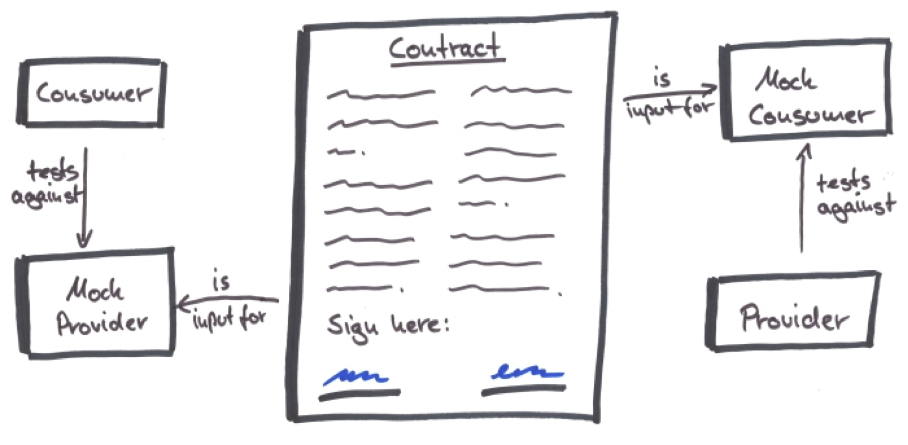
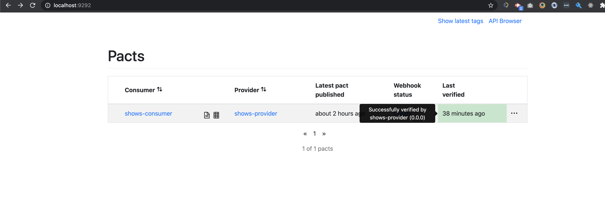
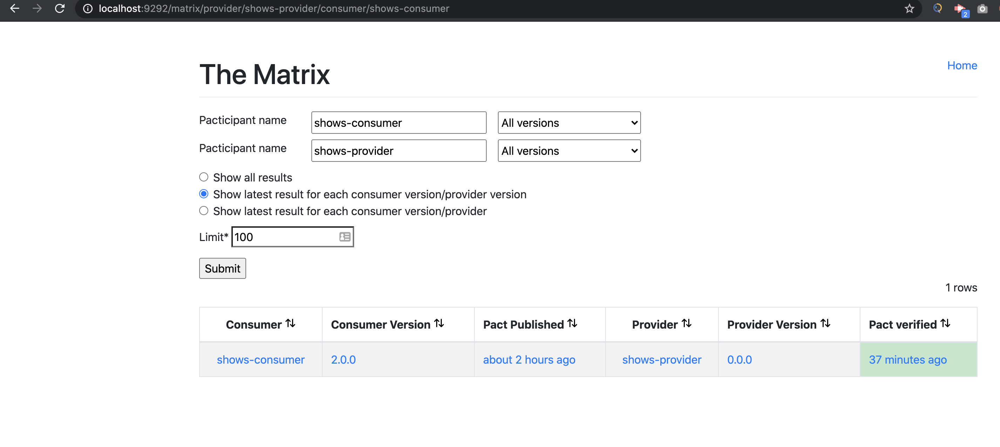

# pact-consumer-js

Reference setup for consumer driven contract tests based on [pact.io](https://pact.io/) framework. 

Consumer tests are written in Javascript, provider verification tests are in JAVA. 

## Workflow looks like following : 

Where the contracts are managed centrally in pact-broker once consumer publishes them. These contracts are used by provider to verify the pact by running the tests from pact locally against a mock consumer. 

## Steps

- From root of the project run `npm install` to install all required devpendencies
- Run pact broker locally using docker `docker run -e PACT_BROKER_DATABASE_ADAPTER=sqlite -e PACT_BROKER_BASIC_AUTH_USERNAME=admin -e PACT_BROKER_BASIC_AUTH_PASSWORD=admin -p 9292:9292 pactfoundation/pact-broker:latest`
- `npm run test:pact:rest` will execute the consumer contract tests and generate the pact contracts under `pact` folder
- `npm run publish:pact` will publish this contract to broker server running in docker

From here provider can pick up the files to verify the contract.

### Status Dashboard on pact broker

